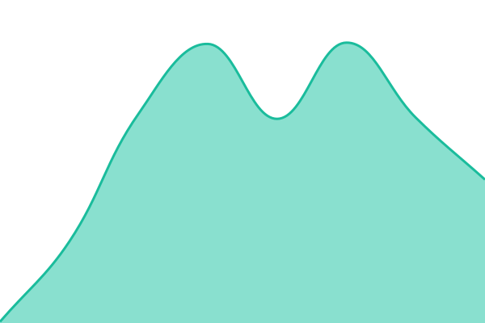
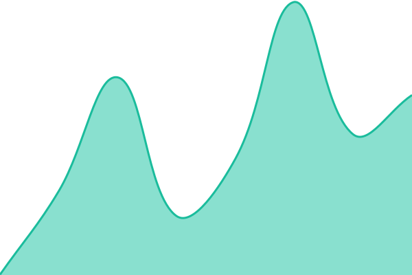

# [📈 Live Status](https://status.restart.new): <!--live status--> **🟩 All systems operational**

This repository contains the open-source uptime monitor and status page for [Restart](https://status.restart.new), powered by [Upptime](https://github.com/upptime/upptime).

With [Upptime](https://upptime.js.org), you can get your own unlimited and free uptime monitor and status page, powered entirely by a GitHub repository. We use [Issues](https://github.com/Skarmy-AI/status/issues) as incident reports, [Actions](https://github.com/Skarmy-AI/status/actions) as uptime monitors, and [Pages](https://status.restart.new) for the status page.

<!--start: status pages-->
<!-- This summary is generated by Upptime (https://github.com/upptime/upptime) -->
<!-- Do not edit this manually, your changes will be overwritten -->
<!-- prettier-ignore -->
| URL | Status | History | Response Time | Uptime |
| --- | ------ | ------- | ------------- | ------ |
|  [Restart Website](https://restart.new) | 🟩 Up | [restart-website.yml](https://github.com/Skarmy-AI/status/commits/HEAD/history/restart-website.yml) | 

 277ms
     
 | 

<a href="https://status.restart.new/history/restart-website">100.00%</a>
    

|  [Restart oEmbed API](https://restart.new/oembed?url=https%3A%2F%2Frestart.new%2F&format=json) | 🟩 Up | [restart-o-embed-api.yml](https://github.com/Skarmy-AI/status/commits/HEAD/history/restart-o-embed-api.yml) | 

 375ms
     
 | 

<a href="https://status.restart.new/history/restart-o-embed-api">100.00%</a>
    

<!--end: status pages-->

[**Visit our status website →**](https://status.restart.new)

## 📄 License

- Powered by: [Upptime](https://github.com/upptime/upptime)
- Code: [MIT](./LICENSE) © [Anand Chowdhary](https://anandchowdhary.com)
- Data in the `./history` directory: [Open Database License](https://opendatacommons.org/licenses/odbl/1-0/)
